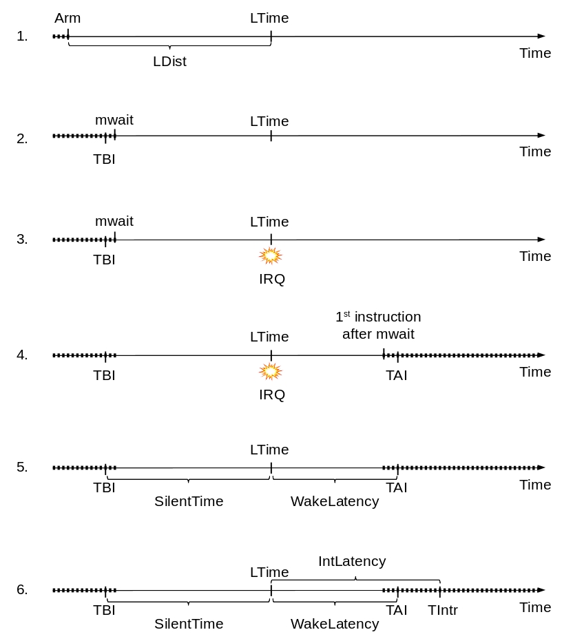
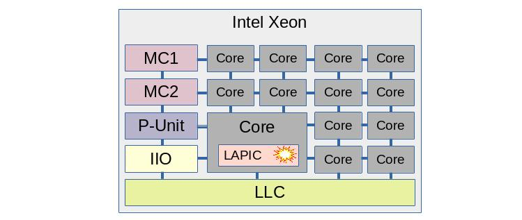

.. -*- coding: utf-8 -*-
.. vim: ts=4 sw=4 tw=100 et ai si

============
How it works
============

.. contents:: Table of Contents

1 Principle of operation
========================

Here is how *wult* works at a very high level.

#. Schedule a delayed interrupt to happen at a future time *LaunchTime*.
#. Let the CPU enter a C-state, where CPU stops executing instructions and saves power.
#. At *LaunchTime*, the delayed interrupt fires and the CPU starts exiting the C-state. This
   process will take some time.
#. When the CPU starts executing instructions, we take the time after idle timestamp (*TAI*).
#. The C-state exit latency is *TAI* - *LaunchTime*.

This process is repeated tens or hundreds of thousands of times and the data are collected in a CSV
file. *Wult* provides a capability for analyzing the CSV file (finding the median, percentiles, etc)
as well as a capability for visualizing the test results (scatter plots, histograms).

1.2. Measured CPU
-----------------

By default, *wult* measures C-state latency of CPU 0 (the first CPU you'll see in ``/proc/cpuinfo``).
The delayed interrupts are affinitized to the measured CPU. However, you can measure any other
CPU as well - there is a command line option for this. But only one CPU is measured at a time.

1.3 Measurement methods
-----------------------

Today *wult* supports three measurement methods: *hrt*, *tdt*, and *nic*. All of these methods
measure C-state latency, but they use different delayed interrupt sources.

#. The *hrt* method uses Linux kernel High Resolution Timers (HRT) for scheduling delayed
   interrupts. HRT is a standard Linux kernel subsystem providing an API for arming a timer. On
   modern Intel hardware, HR timers are backed by TSC deadline timers CPU feature, which is part of
   CPU's LAPIC block. But the timers may also be backed by the "legacy" LAPIC timers as well. This
   is, however, opaque to *wult*'s *hrt* method - it just uses the HRT API.
#. The *tdt* method stands for "TSC deadline timers". This method uses the TSC deadline timer CPU
   feature for scheduling delayed interrupts. Unlike the *hrt* method, *tdt* directly uses some of
   the hardware registers in order to improve accuracy. However, the *tdt* method is more "hacky"
   comparing to the *hrt* method, and it has much less chances to ever be merged upstream. Please,
   use the *hrt* method, unless you have a specific reason to use *tdt*.
#. The *nic* method stands for "Network Interface Card", and it uses a network card for as a delayed
   interrupts source. At this moment, only one type of NIC is supported: Intel I210. Since delayed
   interrupts are originated from a PCIe NIC, this method allows for measuring things like PCIe ASPM
   delay. However, this method requires an I210 NIC to be installed on the measured system.

Please, refer to `this section <#irq-source>`_ for more information on how C-state measurement
results depend on the delayed interrupt source.

.. _idle-states-with-irq-on-off:

1.4 Idle states with interrupts on and off
------------------------------------------

Most idle states are entered and exited with interrupts disabled. This means that Linux kernel's
"cpuidle" subsystem disables idle CPU interrupts before requesting the C-state. On Intel CPUs, a
C-state is requested using the ``mwait`` instruction, so it is executed with interrupts disabled.

When the CPU exits the C-state, it continues executing the next instruction after ``mwait``. Even if
the wake event was an interrupt, the CPU does not jump to it just yet. Instead, it runs small amount
of "cpuidle" subsystem housekeeping code first. Then "cpuidle" enables local CPU interrupts (the
``sti`` instruction on Intel CPUs), and the CPU jumps to the interrupt handler.

For this type of idle state, *wult* measures both wake latency (*WakeLatency*) and interrupt
latency (*IntrLatency*). Wake latency is sampled shortly after ``mwait``, while interrupt latency is
sampled in the interrupt handler.

Some idle states are entered with interrupts enabled, such as the 'POLL' state, which *wult* can
measure too. Another example would be the C1 C-state on Icelake Xeon platform when the
``intel_idle`` driver is used. In these cases when the CPU exists the idle state, it jumps to the
interrupt handler right away.

For this type of idle state, *wult* measures only interrupt latency (*IntrLatency*).

.. _measurement-steps-simple-introff:

1.5 Measurement steps
---------------------

This section will walk you through the main *wult* measurement cycle steps. The goal is to demonstrate
the principle of operation, so many details will be omitted.

Here are the steps for measuring wake latency of a C-state entered with interrupts disabled.

**Step 1: arm delayed event**

Wult kernel driver arms a delayed event. In case of an *hrt* or *tdt* methods, this will be a timer
event. In case of the *nic* method, this will be a NIC event.

The delayed event is armed *LDist* milliseconds ahead. Driver selects a random *LDist* value in
a user-configurable range (0-4 milliseconds by default).

The delayed event is armed to happen at time "LaunchTime", also referred to as *LTime*.

**Step 2: enter idle state**

Once the delayed interrupt is armed, *wult* driver just does nothing and waits for it to happen. Since
*wult* is supposed to be used on an idle system, the measured CPU most probably start entering an idle
state, because there are supposedly no tasks to run.

The CPU runs Linux idle task, which eventually disables local interrupts (the ``cli`` instruction on
Intel CPUs) and requests a C-state by executing the ``mwait`` instruction.

Before Linux requests a C-state, *wult* driver takes the "Time Before Idle" time-stamp, also
referred to as *TBI*. In case of the *tdt* and *hrt* methods, this is the TSC counter value
(the ``rdtsc`` instruction on Intel CPUs). In case of the *nic* method, this is the NIC's own,
independent time stamp counter value.

Once the ``mwait`` instruction is executed, CPU enters a C-state and does not execute more
instructions. Instead, the CPU waits for an event and saves power.

Note, if CPU never enters an idle state during the *LTime* period of time, the delayed interrupt
fires while the CPU is not idle (C0 state). In this case the result of experiment is discarded and
*wult* driver repeats Step 1.

**Step 3: delayed event**

When the delayed event happens, the CPU starts exiting the C-state. This takes some time. Deeper
C-states (e.g., C6 on Intel CPUs) result in longer exit latency than shallower C-states, such as
C1.

**Step 4: resume execution**

Eventually the CPU resumes instructions execution starting from the first instruction after
``mwait``. Even though there is a pending interrupt, the CPU does not handle it yet, because
interrupts are disabled.

**Step 5: wake latency**

Shortly after the CPU wakes up, *wult* driver takes the "Time After Idle" time-stamp, also referred
to as "*TAI*".

*TAI*, *TBI*, and *LTime* are used for calculating *WakeLatency* and *SilentTime*:

* *WakeLatency* = *TAI* - *LTime*
* *SilentTime* = *LTime* - *TBI*

*WakeLatency* is the time between the delayed event and CPU execution resume, modulo the *TAI*
overhead (it takes time to get *TAI*, and there are other instructions between the first executed
instruction and the *TAI* read). In other words, this is an approximation of C-state exit latency.

*SilentTime* is the time between ``mwait`` and the delayed event, modulo the *TBI* overhead (it
takes time to get *TBI*, and there are other instructions between *TBI* read and ``mwait``). In
other words, this is the time the CPU stayed.

**Step 6: interrupt latency**

The CPU continues executing the Linux "cpuidle" subsystem code, doing a bit of housekeeping (e.g.,
take some C-states statistics). Then the interrupts get enabled (the ``sti`` instruction on Intel
CPUs), and the CPU jumps to the interrupt handler.

In the interrupt handler *wult* will take the "Time in Interrupt" time-stamp, also known as
"*TIntr*". This time-stamp is used for calculating Interrupt Latency, also known as "*IntrLatency*".

* *IntrLatency* = *TIntr* - *LTime*

IntrLatency* is the time between the delayed event and the moment CPU reaches delayed event's
interrupt handler, modulo the Linux "cpuidle" subsystem and generic interrupt handling subsystem
overhead. In other words, this is an approximation of interrupt latency.

.. _irq-source:

2 Interrupt source
==================

Measuring C-state wake latency is based on delayed interrupts, and today *wult* supports
two delayed interrupt sources: TSC deadline timer/LAPIC timer (*hrt* and *tdt* methods) and
Intel I210 PCIe NIC (*nic* method).

2.1 Timer
---------

In case of the *hrt* and *tdt* *wult* measurement methods, the delayed events are scheduled by simply
arming a local CPU timer.

All modern Intel CPUs support the TSC deadline timer feature, which is provided by the LAPIC block.
This feature allows for scheduling an interrupt in TSC cycles: the OS basically programs the TSC
counter value for the CPU to generate an interrupt at. TSC (Time Stamp Counter) increments every CPU
cycle, so this is a very high-resolution timer.

On older Intel CPUs, the LAPIC block does not support TSC deadline timers, in which case Linux
kernel uses coarser "LAPIC timers". Linux kernel may fall-back to using LAPIC timers if it detects
that TSC is unstable or if Linux TSC deadline timers support was disabled by the user.

This *hrt* *wult* method should work with both TSC deadline and legacy LAPIC timers. The *tdt*
*wult* method works only with TSC deadline timers.

The picture illustrates a timer interrupt on an Intel Xeon chip. The chip contains many cores,
but only one core is being measured (if hyper-threading is enabled, one hyper-thread is measured).
This core has the LAPIC block, and this block generates the interrupts which *wult*'s *hrt* and *tdt*
methods use for measuring C-state latency.

Just for reference: MC stands for "Memory Controller", LLC stands for Last Level Cache (shared
between the cores). P-unit is a microcontroller responsible for power and performance features like
C-states, P-states, etc.

2.2 NIC
-------

In case of the *nic* *wult* method, the delayed interrupt source is the Intel I210 PCIe network card
(NIC).

.. image:: ../images/wult-irq-source-nic.jpg
    :alt: NIC interrupt illustration.

Notice that the interrupt source is much further from the measured core in this case. The interrupt
signal has to travel via PCIe link(s) and bridge(s) into the IIO block, and then it gets routed to
the measured CPU.

Today, only the Intel I210 NIC is supported, but more NIC types may be supported in the future.
This NIC has a built-in crystal oscillator and provides an independent clock, which can be read by
the CPU. The CPU can program the NIC to generate an interrupt when NIC's clock counter reaches
certain value.

2.3 Timer vs Nic
----------------

Both *hrt*/*tdt* and *nic* methods measure CPU C-state latency, and they may produce similar or
different results depending various factors. Let's look at some of them.

.. _c-state-prewake:

2.3.1 PCIe ASPM
+++++++++++++++

PCIe ASPM (Active State Power Management) is a PCIe power management feature, described in PCIe
specifications and supported by many Intel chips. This feature is about PCI links power management -
when a link is not used, it can be sent into a low power state such as L1. In this state the link
cannot be used, so when there are data to transfer, the link transitions to the L0 state. This
transition requires link re-training and takes time.

PCIe ASPM is typically transparent to Linux - the hardware and firmware manages link states
automatically. However, Linux can enable and disable ASPM for PCIe devices.

Enabling PCIe ASPM for the I210 NIC will increase the measured C-state latency when using the *nic*
method, and won't affect the measured C-state latency when using *hrt*/*tdt* methods.

`Here is a diff <../results/ivt-nic-c6-hfm-aspm-vs-noaspm/index.html>`_ for an Intel Xeon E5-2697 v2
system. It compares C-state latency for PCIe ASPM enabled and disabled configurations. The deepest
C-state was C6. The median wake latency is 82.6us (ASPM on) and 73.8us (ASPM off), which means that
PCIe ASPM adds about 8.8 microseconds to the median.

Here is a small decoder for the "ivt-nic-c6-hfm-noaspm" name:

* ivt - comes from IvyTown, name of the server platform that we tested.
* nic - the result was produced using the *nic* method.
* c6 - the deepest C-state Linux was allowed to request when we ran *wult* was "C6".
* hfm - comes from "High Frequency Mode", same as base frequency. This means that in this test
  we locked CPU frequency to HFM, so CPU frequency transitions were disabled.
* noaspm - PCIe ASPM was disabled.

.. _i210-warning:

2.3.1.1 A word of warning
*************************

The Intel I210 network card is a relatively old design - it is a PCIe Gen 2 card, while modern Intel
CPUs are PCIe Gen 4 and Gen 5. Therefore, this network card may not be a perfect device for
measuring PCI-related delays. We did not have time to support a more modern NIC, but this should
generally be possible.

2.3.2 C-state pre-wake
++++++++++++++++++++++

Some Intel CPUs have able to pre-wake the CPU from a C-state if there is a timer firing soon.
The P-unit on such systems is timer-aware and optimizes some of the C-states. Not every Intel chip,
however, has this feature.

Interrupts from a NIC can not be predicted by the P-unit and therefore, the C-state pre-wake
feature cannot reduce the measured C-state latency.

`Here is an example test result <../results/ivt-c6-hfm-nic-vs-tdt/index.html>`_ for an Intel Xeon
E5-2697 v2 system. It is actually a diff comparing C-state latency for the *nic* and *tdt*
measurement methods. The deepest C-state was C6. Notice that the median wake latency is 73.8us (nic)
and 17.6us (timer). The timer method shows about 76% latency reduction.

Note, you can disable the pre-wake feature and measure the "unoptimized" C-state latency even with
the *hrt* or *tdt* methods (e.g., verified on IceLake Xeon). You can do this using the
`pepc tool <https://github.com/intel/pepc>`_.

2.3.3 PCI topology
++++++++++++++++++

When using the *nic* measurement method, the location of the NIC in the PCIe matters. E.g., consider
a 2-socket server system with the following PCIe slots.

* Slot A is connected directly to the IIO block (part of the "north complex") of socket 0.
* Slot B is connected directly to the IIO block of socket 1.
* Slot C is connected to PCH, which is connected to socket 0.

Suppose we are measuring C-state latency of CPU0, which is on core 0 of socket 0. In this case Slot
A provides the shortest and fastest path. Slot B provides longer and slower path, because
interrupts (typically MSI messages) will be delivered to socket 1, and then to socket 0. And slot C
provides provides a longer path as well.
