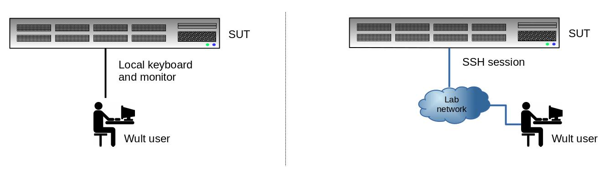

.. -*- coding: utf-8 -*-
.. vim: ts=4 sw=4 tw=100 et ai si

==========
User Guide
==========

.. contents:: Table of Contents

.. _usage-models:

1 Usage models
==============

There are 2 *wult* usage models - **local** and **remote**. Most users prefer the local usage model,
because it is more straight-forward.

In both usage models *wult* command line arguments are the same except for the `-H SUTNAME` option,
that you should add in the remote usage case. This option specifies the SUT host name *wult* should
connect to.

.. _local-usage-model:

1.1 Local usage model
---------------------

In the local usage model, the user runs *wult* on the SUT. *Wult* measures the SUT and stores the
measurement results on the SUT.

.. _remote-usage-model:

2.2 Remote usage model
----------------------

.. image:: ../images/wult-remote-usage-model.jpg
    :alt: Example of remote wult usage.

In case of remote usage model, the user runs *wult* on the controller. *Wult* connects to the SUT
over the network, exercises the SUT, and stores the results on the controller.

In the remote usage model a single controller may exercise many SUTs at the same time (multiple
instances of *wult* running simultaneously). The other advantage of this usage model is that you run
*wult* as a non-privileged user on the controller. However, you should have root SSH login
configured on the SUT (`here is how to do this <install-guide.html#passwordless-ssh>`_).

2. Scan for supported devices
=============================

Start with scanning for supported delayed interrupt source devices. Run the following command on the
SUT using the the local usage model: ::

 sudo wult scan

 Compatible device(s):
  * Device ID: tdt
    - Alias: tsc-deadline-timer
    - Description: TSC deadline timer
  * Device ID: hrtimer
    - Alias: hrt
    - Description: Linux High Resolution Timer
  * Device ID: 0000:38:00.0
    - Alias: enp1s0
    - Description: Intel I210 (copper). PCI address 0000:38:00.0, Vendor ID 8086, Device ID 0000:38:00.0.

The example output lists 3 devices that can be used as delayed interrupt sources for *wult*:

* *tdt* - the TCS deadline timer.
* *hrtimer* or *hrt* - the high resolution timer, **this is what we recommend to use** to most users.
* *0000:38:00.0* - this is the PCI address of the I210 NIC. This NIC is also available under the
  `enp1s0` name, which is actually the Linux network interface name. Please, check the
  `this howto section <howto.html#use-wult-with-intel-i210>`_.

3. Start the measurements
=========================

Before you start *wult*, you should know which method you are going to use.
`This section may help <how-it-works.html#irq-source>`_.

The basic way to start *wult* is by running `wult start DeviceID`, and `DeviceID`'s are provided by
`wult scan`. If unsure, use *hrt*.

For example, to run *wult* using the *hrt* method, run: ::

 wult start hrt

This command will collect 1000000 datapoints and save them in current directory in a sub-directory
like `wult-hrt-<date>`. Here are the options you may want to use as well.

* `-c` - count of datapoints to collect (default is 1000000).
* `--reportid` - report ID of the result. Use a short, but descriptive string to describe the test
  run.
* `-o` - the output directory path.
* `--cpunum` - the CPU to measure the C-state latency on (default is CPU 0).

Check `wult start -h` for more information.

4. Generate HTML report
=======================

The `wult start` command measures the SUT and saves the result in the `datapoints.csv` file, along
with some additional metadata in the `info.yml` file. We also refer to these results as "raw
results".

One way to quickly inspect the results in the command line is by using the `wult stats` and `wult
filter` commands. But you also can generate an HTML report with `wult report`. Here is how to
generate an HTML report for the raw results in `all-cstates-enabled`: ::

 wult report all-cstates-enabled

The HTML report will be saved in `all-cstates-enabled/html-report` sub-directory. Use `-o` option to
specify a different path to save the HTML report in.

Note, you can generate a **diff** too. A diff is an HTML report for multiple raw results. Diffs make
it easier to compare test results. Just give `wult report` multiple raw test results to generate a
diff.

4.1. Advanced example
---------------------

This section describes how `this diff <../results/ivt-c6-hfm-nic-vs-tdt/index.html>`_ was generated.
The diff compares *nic* and *tdt* results for the same system (details
`here <how-it-works.html#c-state-prewake>`_).

We had two raw test results: ::

 $ ls
 ivt-nic-c6-hfm-noaspm  ivt-tdt-c6-hfm-noaspm

First is for the *nic* method, second is for the *tdt* method. We started with a default
`wult report` options: ::

 $ wult report -o ivt-c6-hfm-nic-vs-tdt ivt-nic-c6-hfm-noaspm ivt-tdt-c6-hfm-noaspm

 $ du -sh ivt-c6-hfm-nic-vs-tdt/
 406M	ivt-c6-hfm-nic-vs-tdt/

This resulted in a 406M HTML report, which is too large to publish in GitHub web pages.

Each raw result contained 1000000 datapoints, which is quite a lot. So we decided to use only 10000
datapoints out of 1M. ::

 $ rm -r ivt-c6-hfm-nic-vs-tdt
 $ wult report -o ivt-c6-hfm-nic-vs-tdt --rsel 'index < 10000' ivt-nic-c6-hfm-noaspm ivt-tdt-c6-hfm-noaspm

 $ du -sh ivt-c6-hfm-nic-vs-tdt
 11M	ivt-c6-hfm-nic-vs-tdt

This 11M diff was more suitable *wult* web pages.
